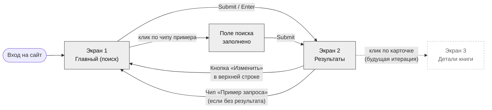
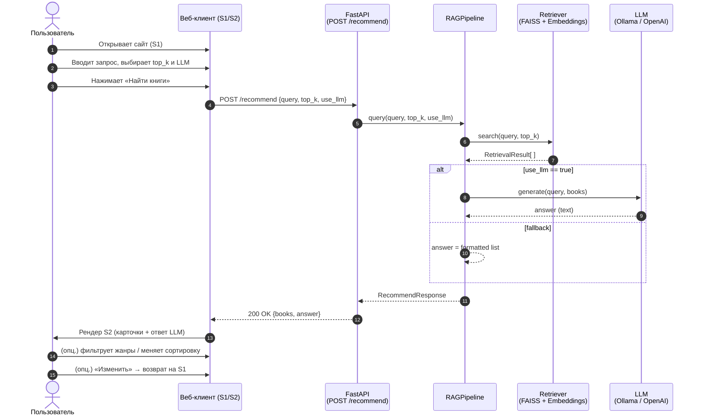
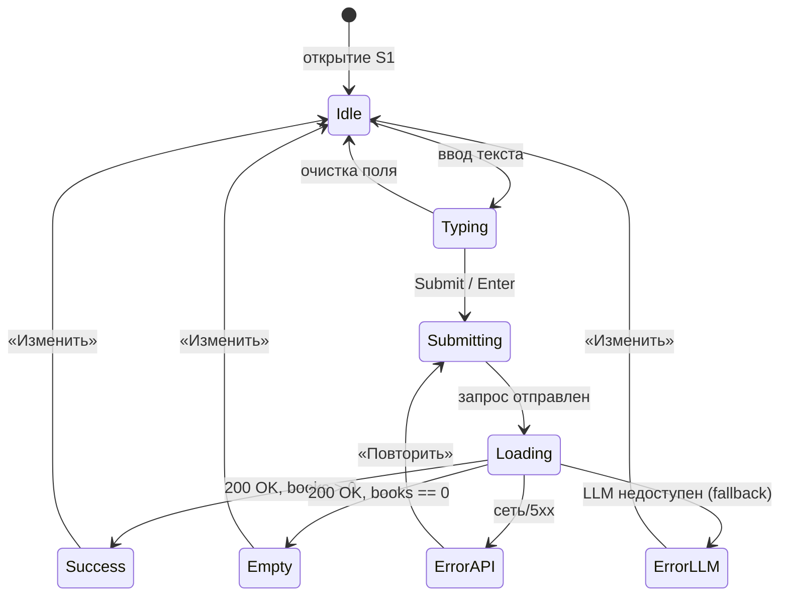

# Прототип интерфейса (wireframe)
Прототип отражает пользовательский интерфейс системы рекомендаций книг на основе RAG: от ввода свободного запроса до получения списка релевантных книг и объяснения от LLM. Показывает ключевые экраны, с которыми пользователь работает для решения задачи подбора книги.

---

## 1. Назначение прототипа

Прототип фиксирует пользовательский интерфейс веб-клиента, надстраиваемого над HTTP API, описанным в `api.py` (эндпоинт `POST /recommend`). Он отвечает на вопрос: *как пользователь, не знакомый с командной строкой и с FastAPI Swagger UI, должен взаимодействовать с системой рекомендаций?*

В соответствии с заданием прототип:
- покрывает ключевой пользовательский сценарий (ввод свободного запроса → получение списка релевантных книг с пояснением LLM);
- выполнен в стиле lo-fi wireframe (чёрно-серая палитра, плейсхолдеры обложек, отсутствие декоративной графики) — этого уровня детализации достаточно для защиты ВКР и согласования с заказчиком;
- сопровождается схемами переходов и комментариями по элементам.

---

## 2. Ссылки на Figma

Файл создан в личном пространстве Figma `daniil` (план *Starter*).

- **Файл (целиком):** <https://www.figma.com/design/evu65LQFKqeuhvvxHQZhj7/%D0%92%D0%9A%D0%A0-%E2%80%94-RAG-Book-Recommender-%E2%80%94-Wireframes>
- **Экран 1 — Главный (поиск):** <https://www.figma.com/design/evu65LQFKqeuhvvxHQZhj7/?node-id=1-2>
- **Экран 2 — Результаты поиска:** <https://www.figma.com/design/evu65LQFKqeuhvvxHQZhj7/?node-id=1-49>

Снимки экранов в PNG/SVG можно экспортировать прямо из Figma (`Right-click → Copy/Paste as → Copy as PNG / Copy as SVG`) или через `Export` в правой панели — разрешение 1×, 2×, 3× для Retina.

---

## 3. Карта экранов и навигации



> **Объём прототипа.** В соответствии с уточнениями к заданию в прототипе детально проработаны экраны 1 и 2. Экран 3 («Детали книги») обозначен пунктиром как точка расширения — он не входит в текущий MVP, но архитектурно подготовлен (поле `title` в карточке используется как якорь будущей навигации).

---

## 4. Экран 1 — Главный (поиск)

> Полноценный макет: <https://www.figma.com/design/evu65LQFKqeuhvvxHQZhj7/?node-id=1-2>

### 4.1. Назначение

Точка входа в систему. Обнуляет когнитивную нагрузку: на экране только то, что нужно для одного действия — сформулировать запрос и нажать «Найти книги». Соответствует UX-паттерну *«одно главное действие на экране»* (Hick's law).

### 4.2. Схематичная структура (ASCII)

```
┌────────────────────────────────────────────────────────────────────┐
│  ▣ BookRAG                                  Поиск  О системе  API  │  ← Header
├────────────────────────────────────────────────────────────────────┤
│                                                                    │
│                    Найдите книгу по описанию                       │  ← H1
│         Опишите своими словами, что хотите почитать —              │  ← подзаголовок
│         система предложит подходящие книги                         │
│                                                                    │
│        ┌──────────────────────────────────────────────────┐        │
│        │ Например: «Хочу детектив с неожиданной концовкой │        │  ← textarea (multi-line)
│        │  и атмосферой викторианской Англии»              │        │     placeholder = пример
│        │                                                  │        │
│        └──────────────────────────────────────────────────┘        │
│                                                                    │
│        Кол-во книг: [ − ] 5 [ + ]   ⬤── Использовать LLM           │  ← top-k stepper + LLM toggle
│                                                                    │
│                       ┌─────────────────────┐                      │
│                       │   Найти книги  →    │                      │  ← primary CTA
│                       └─────────────────────┘                      │
│                                                                    │
├────────────────────────────────────────────────────────────────────┤
│                       Примеры запросов                             │
│  (научная фантастика…)  (лёгкое чтение…)  (русская классика…)…     │  ← chips, кликабельные
│  ⓘ База: 15 851 книга. Поддерживаются запросы на ru / en.          │
└────────────────────────────────────────────────────────────────────┘
│  BookRAG · ВКР · RAG-система рекомендаций книг…                    │  ← footer
└────────────────────────────────────────────────────────────────────┘
```

### 4.3. Описание элементов

| ID | Элемент | Назначение | Связь с кодом |
|---|---|---|---|
| H1 | Логотип «▣ BookRAG» + навигация | Идентификация продукта, переходы по верхнему меню | — |
| S1 | Поле ввода запроса (textarea, 820 × 130 px) | Свободный текстовый запрос пользователя | поле `query` в `RecommendRequest` (`api.py`) |
| S2 | Stepper «Кол-во книг» | Контроль `top_k` (диапазон 1–20, шаг 1, дефолт 5) | поле `top_k` в `RecommendRequest`; `RAG_TOP_K` в `config.py` |
| S3 | Toggle «Использовать LLM» | Включает/выключает генерацию объяснения LLM | поле `use_llm` в `RecommendRequest`; флаг `--no-llm` в `main.py` |
| S4 | Кнопка «Найти книги →» | Submit формы | `POST /recommend` → `RAGPipeline.query()` |
| EX | Чипы «Примеры запросов» | Демонстрация возможностей; клик заполняет поле S1 готовым запросом | пресет на фронтенде |
| INFO | Информационная подпись | Сообщает размер базы и поддерживаемые языки | данные из `GET /health` |

### 4.4. Комментарии по поведению

- **Submit-триггеры:** клавиша `Enter` (без `Shift`) внутри поля S1 эквивалентна нажатию S4. `Shift+Enter` — перенос строки внутри textarea.
- **Disabled-состояние S4:** кнопка неактивна, пока в S1 < 3 непробельных символов (защита от пустых/мусорных запросов; коррелирует с фильтром `len(description) < 50` в `data_loader.py`, идея валидации входных данных).
- **Loading-состояние:** при отправке формы кнопка S4 заменяется на лейбл `«Ищем… ⠋»` со скелетоном-индикатором; S1, S2, S3 блокируются (read-only) до получения ответа от `/recommend`.
- **Error-состояние:** если LLM недоступен (например, Ollama не запущена), система не падает, а возвращает результаты без поля `answer` (см. fallback-логику в `RAGPipeline.query()`). На UI это отображается баннером в верхней части экрана 2: `⚠ LLM недоступен — показан только семантический поиск`.
- **Ширина:** макет рассчитан на 1280 px (десктоп). Брейкпоинты для адаптива: `≥1024 px` — текущий вид, `≥768 px` — навигация сворачивается в гамбургер, S2/S3 переносятся на новую строку, `<768 px` — мобильная вертикаль (вне рамок ВКР).

---

## 5. Экран 2 — Результаты поиска

> Полноценный макет: <https://www.figma.com/design/evu65LQFKqeuhvvxHQZhj7/?node-id=1-49>

### 5.1. Назначение

Отображение ответа системы. Двухколоночная компоновка: слева — мета-информация о запросе и фильтры пост-обработки, справа — связное объяснение LLM и список карточек найденных книг.

### 5.2. Схематичная структура (ASCII)

```
┌──────────────────────────────────────────────────────────────────────────────┐
│ ▣ BookRAG  ⌕ хочу детектив с неожиданной концовкой…       [ Изменить ]      │  ← Header + компактный поиск
├──────────────────────────┬───────────────────────────────────────────────────┤
│  Параметры поиска        │ ⬤ Объяснение библиотечного ассистента  [gemma3:4b]│  ← LLM-карточка
│  ──────────────────────  │ На основе вашего запроса я бы выделил три         │
│  Найдено книг        5   │ варианта. «Имя розы» Умберто Эко даст монастыр-   │
│  LLM            Включён  │ ский детектив … подробности — в карточках ниже.   │
│  Модель      MiniLM-L12  │ [👍 Полезно] [👎 Мимо] [↻ Перегенерировать]       │
│  Время         1.4 с     ├───────────────────────────────────────────────────┤
│  ──────────────────────  │ Найдено 5 книг       Сортировка: по релевантн. ▾  │
│  Жанры в результатах     │                                                   │
│  ☐ Mystery (4)           │ ┌─────────────────────────────────────────────┐   │
│  ☐ Fiction (5)           │ │ ▭     The Name of the Rose        [#1]      │   │
│  ☐ Detective (3)         │ │ обл.  Umberto Eco                           │   │
│  ☐ Historical (2)        │ │       Mystery · Historical · Fiction…       │   │
│  ☐ Crime (3)             │ │       Монастырский детектив XIV века…       │   │
│  ──────────────────────  │ │  [★ 4.16] [Релев.: 0.612]  [Подробнее →]    │   │
│  Минимальный рейтинг     │ └─────────────────────────────────────────────┘   │
│  ─────⊙──────────────    │                                                   │
│  3.5 ★ и выше            │ ┌─────────────────────────────────────────────┐   │
│                          │ │ ▭     A Study in Scarlet         [#2]       │   │
│                          │ │ обл.  Arthur Conan Doyle                    │   │
│                          │ │       Mystery · Detective · Classics…       │   │
│                          │ │  [★ 3.97] [Релев.: 0.589] …                 │   │
│                          │ └─────────────────────────────────────────────┘   │
│                          │                  …                                │
│                          │ (5 карточек по `top_k`)                           │
└──────────────────────────┴───────────────────────────────────────────────────┘
```

### 5.3. Описание элементов

| ID | Элемент | Назначение | Связь с кодом |
|---|---|---|---|
| H | Header с компактной строкой запроса | Контекст «что искали»; кнопка `Изменить` возвращает на S1 с предзаполненным полем | — |
| F | Левая колонка «Параметры поиска» | Прозрачность работы системы (что повлияло на ответ) | значения из `RecommendResponse` + клиентская сортировка/фильтрация |
| F1 | Чекбоксы жанров | Клиентская фильтрация выдачи без повторного похода в API | `genres` из `RetrievalResult` |
| F2 | Слайдер «Минимальный рейтинг» | Клиентская фильтрация по `avg_rating` | `avg_rating` из `RetrievalResult` |
| L | Карточка ответа LLM | Развёрнутое объяснение выбора | поле `answer` из `RecommendResponse`; модель — `RAG_LLM_MODEL` |
| L1 | Действия `👍 / 👎 / ↻` | Сбор обратной связи + повторная генерация (та же выдача, новая температура) | `RAG_LLM_TEMPERATURE` |
| ST | Строка «Найдено N книг» + сортировка | Сводка по выдаче; сортировка: релевантность / рейтинг / алфавит | `score`, `avg_rating`, `title` |
| C | Карточка книги (× `top_k`) | Атомарное представление одной рекомендации | один объект `Book` из массива `RecommendResponse.books` |
| C1 | Плейсхолдер обложки | Заглушка под обложку (датасет Goodreads без бинарных файлов) | поле для будущей интеграции |
| C2 | `★` + рейтинг | Социальное доказательство Goodreads | `avg_rating` |
| C3 | Чип «Релевантность: 0.612» | Скор семантического поиска (косинусное сходство) | `score` из `RetrievalResult` |
| C4 | Кнопка «Подробнее →» | Переход на карточку книги (вне MVP) | future `GET /book/{id}` |
| C5 | Кнопка «♡ В избранное» | Сохранение книги в локальный список (LocalStorage) | вне API |

### 5.4. Комментарии по поведению

- **Сортировка по умолчанию:** `score` по убыванию (как возвращает FAISS). Альтернативы — `avg_rating` (читательский рейтинг) и `title` (алфавит).
- **Фильтры F1/F2 — клиентские.** Они не вызывают повторный `POST /recommend`. Это сознательный выбор: при `top_k = 5..20` фильтрация происходит мгновенно, без расхода ресурсов LLM.
- **Карточка LLM (L):** при `use_llm = false` блок скрывается, и сразу под Header начинается строка ST.
- **Бейдж модели `gemma3:4b`** показывает, какая LLM ответила. Если в `.env` сменить `RAG_LLM_MODEL`, бейдж обновится — это полезно при сравнении провайдеров (Ollama / OpenAI / Gemini) во время защиты ВКР.
- **Кнопка «Изменить» в Header** возвращает на S1 с тем же `query` в textarea и сохранёнными значениями `top_k` / `use_llm` (стейт держится в URL: `?q=…&k=5&llm=1`).
- **Empty state** (если `books == []`): вместо списка карточек показывается блок «По запросу ничего не нашлось» + чипы «Похожие запросы» + кнопка «Изменить запрос».
- **Скелетоны при загрузке:** карточки рендерятся серыми прямоугольниками той же высоты — снижает воспринимаемое время отклика.

---

## 6. Сценарий взаимодействия пользователя (sequence)



---

## 7. Состояния экранов (state diagram)



---

## 8. Дизайн-система прототипа

| Токен | Значение | Применение |
|---|---|---|
| `bg` | #F7F7F7 | Фон страницы |
| `surface` | #FFFFFF | Карточки, header |
| `border` | #C7C7C7 | Контуры элементов |
| `border-strong` | #8C8C8C | Контуры активных полей |
| `text` | #212121 | Основной текст |
| `text-muted` | #6B6B6B | Подписи, мета |
| `accent` | #333333 | CTA, тогглы |
| `radius-sm` | 4 px | Чипы, кнопки |
| `radius-md` | 8 px | Карточки, текстовые поля |
| Шрифт | Inter | Регулярный / Medium / Semi Bold / Bold |

> Намеренно использована *гипоцветная* палитра: задача lo-fi-макета — обсуждать структуру и логику, а не цвет. На этапе hi-fi (вне рамок текущего этапа) акцент `#333` будет заменён на брендовый цвет.

---

## 9. Соответствие функциональности кода и UI

| Возможность кода | Где в UI |
|---|---|
| `RAGPipeline.query()` → семантический поиск | Кнопка «Найти книги» (S4 на экране 1) |
| Параметр `top_k` | Stepper S2 на экране 1; значение «Найдено N книг» в ST на экране 2 |
| Флаг `use_llm` / `--no-llm` | Toggle S3 на экране 1; карточка ответа L (или её отсутствие) на экране 2 |
| Поля `RetrievalResult` (title, author, genres, description, avg_rating, score) | Карточка книги C на экране 2 |
| Поле `answer` от LLM | Карточка L на экране 2 |
| Fallback при недоступной LLM | Баннер `⚠ LLM недоступен` (см. §4.4) |
| `GET /health` (количество книг) | Подпись «База: 15 851 книга» на экране 1 |
| Запросы на русском при английском датасете (мультиязычная модель MiniLM-L12-v2) | Подпись «Поддерживаются запросы на ru / en» на экране 1 |

---

## 10. Возможные расширения прототипа

1. **Экран 3 — «Детали книги»** (пунктир в §3): полное описание, похожие книги (через тот же FAISS-поиск по эмбеддингу карточки), кнопка «Найти подобное».
2. **История запросов / Профиль:** локальный список последних 20 запросов, избранные книги (LocalStorage). Не требует серверной БД.
3. **A/B-сравнение LLM:** карточка ответа в двух вкладках (`gemma3:4b` vs `gpt-4o-mini`) для иллюстрации в защитной речи.
4. **Тёмная тема:** инвертирование палитры из §8 — токены остаются те же, переключатель в Header.
5. **Экспорт подборки:** кнопка «Скачать .txt / .md» с топ-N книгами для офлайн-использования.

---

*Артефакт подготовлен для ВКР. Lo-fi wireframe — Figma + Markdown с Mermaid.*
